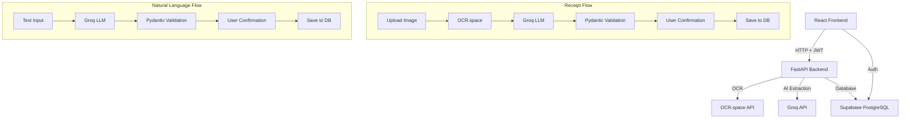

# AI Receipt & Expense Tracker

[](https://ai-expense-tracker-wheat.vercel.app)
[](https://github.com/kunjvachharajani/Ai-Expense-Tracker)

**Live Demo (Frontend):** [https://ai-expense-tracker-wheat.vercel.app](https://ai-expense-tracker-wheat.vercel.app)

An AI-powered expense tracking web application that lets you track daily expenses through **natural language** and **receipt scanning**. Built with FastAPI, React, Groq AI, OCR.space, and Supabase.

---

## Features

- **Natural Language Expense Entry** — Type "Spent 150 on chai and samosa" and AI extracts structured data
- **Receipt Scanning** — Upload a receipt photo → OCR → AI extraction → structured expense data
- **User Confirmation** — AI never saves directly; users always review and confirm
- **Dashboard** — Real-time stats, charts, and AI-generated spending summaries
- **Expense Management** — Full CRUD with search, filters, sorting, pagination
- **Analytics** — Spending by category, daily trends, top merchants, period comparisons
- **Budgets** — Set monthly budgets per category with progress tracking and warnings
- **Authentication** — Supabase Auth with email/password, full user isolation
- **Responsive Design** — Works on desktop, tablet, and mobile

---

## Architecture



---

## Tech Stack

| Layer | Technology |
|-------|-----------|
| Frontend | React 18 + Vite |
| Backend | Python FastAPI |
| AI/LLM | Groq (Llama 3.1 70B) |
| OCR | OCR.space API |
| Database | Supabase PostgreSQL |
| Auth | Supabase Auth |
| Charts | Recharts |
| HTTP Client | httpx (backend), fetch (frontend) |
| Validation | Pydantic v2 |

---

## Folder Structure

```
ai-receipt-expense-tracker/
├── backend/
│   ├── app/
│   │   ├── api/
│   │   │   ├── auth.py          # JWT verification dependency
│   │   │   ├── expenses.py      # Expense CRUD + AI parsing
│   │   │   ├── receipts.py      # Receipt scanning endpoint
│   │   │   ├── analytics.py     # Analytics & summaries
│   │   │   └── budgets.py       # Budget CRUD
│   │   ├── models/
│   │   │   └── categories.py    # Category/payment constants
│   │   ├── schemas/
│   │   │   ├── expense.py       # Pydantic schemas
│   │   │   └── budget.py        # Budget schemas
│   │   ├── services/
│   │   │   ├── groq_service.py  # Groq AI integration
│   │   │   ├── ocr_service.py   # OCR.space integration
│   │   │   └── analytics_service.py
│   │   ├── database/
│   │   │   └── supabase.py      # Supabase client
│   │   ├── utils/
│   │   │   └── dates.py         # Date parsing helpers
│   │   ├── config.py            # Environment config
│   │   └── main.py              # FastAPI app entry
│   ├── database_setup.sql       # Supabase SQL migration
│   ├── requirements.txt
│   └── .env.example
│
├── frontend/
│   ├── src/
│   │   ├── components/
│   │   │   ├── Sidebar.jsx
│   │   │   ├── Header.jsx
│   │   │   └── ConfirmExpenseModal.jsx
│   │   ├── pages/
│   │   │   ├── Dashboard.jsx
│   │   │   ├── AddExpense.jsx
│   │   │   ├── ScanReceipt.jsx
│   │   │   ├── Expenses.jsx
│   │   │   ├── Analytics.jsx
│   │   │   ├── Budgets.jsx
│   │   │   ├── Settings.jsx
│   │   │   ├── Login.jsx
│   │   │   └── Signup.jsx
│   │   ├── services/
│   │   │   ├── api.js           # Backend API calls
│   │   │   └── supabaseClient.js
│   │   ├── hooks/
│   │   │   └── useAuth.jsx      # Auth context
│   │   ├── App.jsx
│   │   ├── main.jsx
│   │   └── index.css            # Design system
│   ├── index.html
│   ├── .env.example
│   └── package.json
│
└── README.md
```

---

## Setup Instructions

### Prerequisites

- Python 3.10+
- Node.js 18+
- Supabase account (free tier works)
- Groq API key (free at console.groq.com)
- OCR.space API key (free at ocr.space)

### 1. Supabase Setup

1. Create a new project at [supabase.com](https://supabase.com)
2. Go to **SQL Editor** and run the contents of `backend/database_setup.sql`
3. Go to **Settings → API** and copy:
   - Project URL
   - `anon` public key
   - `service_role` secret key
4. Under **Authentication → Settings**, ensure email/password sign-in is enabled

### 2. API Keys

| Service | Get Key At |
|---------|-----------|
| Groq | [console.groq.com](https://console.groq.com) |
| OCR.space | [ocr.space/ocrapi](https://ocr.space/ocrapi) |
| Supabase | Your project's Settings → API |

### 3. Backend Setup

```bash
cd backend

# Create virtual environment
python -m venv venv
venv\Scripts\activate        # Windows
# source venv/bin/activate   # Mac/Linux

# Install dependencies
pip install -r requirements.txt

# Configure environment
copy .env.example .env       # Windows
# cp .env.example .env       # Mac/Linux

# Edit .env and fill in your keys:
# GROQ_API_KEY=gsk_...
# OCR_SPACE_API_KEY=K...
# SUPABASE_URL=https://xxx.supabase.co
# SUPABASE_ANON_KEY=eyJ...
# SUPABASE_SERVICE_ROLE_KEY=eyJ...

# Run the server
uvicorn app.main:app --reload --port 8000
```

### 4. Frontend Setup

```bash
cd frontend

# Install dependencies
npm install

# Configure environment
copy .env.example .env       # Windows
# cp .env.example .env       # Mac/Linux

# Edit .env:
# VITE_API_URL=http://localhost:8000
# VITE_SUPABASE_URL=https://xxx.supabase.co
# VITE_SUPABASE_ANON_KEY=eyJ...

# Run dev server
npm run dev
```

Open http://localhost:5173 in your browser.

---

## API Endpoints

| Method | Endpoint | Description |
|--------|---------|-------------|
| GET | `/api/health` | Health check |
| GET | `/api/categories` | List all categories |
| POST | `/api/expenses/parse-text` | Parse natural language → structured expense |
| POST | `/api/expenses` | Create expense |
| GET | `/api/expenses` | List expenses (with filters/pagination) |
| GET | `/api/expenses/{id}` | Get single expense |
| PUT | `/api/expenses/{id}` | Update expense |
| DELETE | `/api/expenses/{id}` | Delete expense |
| POST | `/api/receipts/scan` | Upload receipt → OCR → AI extraction |
| GET | `/api/analytics/summary` | Spending summary by period |
| GET | `/api/analytics/recent` | Recent expenses |
| GET | `/api/analytics/ai-summary` | AI-generated spending summary |
| GET | `/api/budgets` | List budgets |
| POST | `/api/budgets` | Create/update budget |
| PUT | `/api/budgets/{id}` | Update budget |
| DELETE | `/api/budgets/{id}` | Delete budget |

All endpoints except `/api/health` and `/api/categories` require a valid JWT in the `Authorization: Bearer <token>` header.

---

## Database Schema

### expenses
| Column | Type | Notes |
|--------|------|-------|
| id | UUID | Primary key |
| user_id | UUID | References auth.users |
| amount | DECIMAL(12,2) | Must be > 0 |
| currency | VARCHAR(10) | Default: INR |
| category | VARCHAR(50) | From allowed list |
| subcategory | VARCHAR(50) | Optional |
| merchant | VARCHAR(200) | Optional |
| description | TEXT | Optional |
| expense_date | DATE | Required |
| payment_method | VARCHAR(50) | Default: Unknown |
| source | VARCHAR(30) | manual/natural_language/receipt |
| receipt_image_url | TEXT | Optional |
| ocr_text | TEXT | Raw OCR output |
| created_at | TIMESTAMPTZ | Auto |

### budgets
| Column | Type | Notes |
|--------|------|-------|
| id | UUID | Primary key |
| user_id | UUID | References auth.users |
| category | VARCHAR(50) | "overall" or category name |
| amount | DECIMAL(12,2) | Must be > 0 |
| month | VARCHAR(7) | YYYY-MM format |
| created_at | TIMESTAMPTZ | Auto |

Row Level Security is enabled on both tables — users can only access their own data.

---

## AI Pipeline

### Natural Language → Expense
```
User text
  → Groq LLM (with date context + category constraints)
  → JSON response
  → Pydantic validation (AIExpenseExtraction)
  → Frontend confirmation UI
  → User edits/confirms
  → POST /api/expenses
  → Supabase INSERT
```

### Receipt → Expense
```
Receipt image
  → OCR.space API (Engine 2)
  → Raw OCR text
  → Groq LLM (receipt extraction prompt)
  → JSON response
  → Pydantic validation
  → Frontend confirmation UI
  → User edits/confirms
  → POST /api/expenses
  → Supabase INSERT
```

### Key Safety Measures
- AI output **never** directly modifies the database
- All AI responses are validated with Pydantic before display
- Users must explicitly confirm before saving
- Categories are constrained to an allowed list
- Dates are validated and clamped (no future dates)
- Amount must be > 0
- Merchant/payment set to null/"Unknown" when AI is unsure

---

## Deployment

### Backend (any Python host)
```bash
pip install -r requirements.txt
uvicorn app.main:app --host 0.0.0.0 --port 8000
```

### Frontend (Vercel)

- **Production URL:** [https://ai-expense-tracker-wheat.vercel.app](https://ai-expense-tracker-wheat.vercel.app)
- **CI/CD Integration:** Connected directly to GitHub repository (`kunjvachharajani/Ai-Expense-Tracker`). Every push to the `main` branch automatically triggers an optimized production deployment.
- **Root Directory:** `frontend/`
- **Build Command:** `npm run build`
- **Output Directory:** `dist`

#### Environment Variables (Vercel Project Settings)
| Variable | Description |
|---|---|
| `VITE_SUPABASE_URL` | Supabase Project URL |
| `VITE_SUPABASE_ANON_KEY` | Supabase Anonymous Key |
| `VITE_API_URL` | Backend API URL (or production backend URL) |

---

## Troubleshooting

| Issue | Solution |
|-------|---------|
| CORS errors | Ensure `FRONTEND_URL` in backend `.env` matches your frontend origin |
| 401 Unauthorized | Check that Supabase keys are correct and JWT is being sent |
| OCR returns empty | Try a clearer image; OCR.space Engine 2 works best with receipts |
| AI returns invalid JSON | The system retries with code-fence stripping; if persistent, try a different Groq model |
| Supabase RLS errors | Run the full `database_setup.sql` including RLS policies |
| Import errors | Ensure you're running from the `backend/` directory so Python finds `app.*` |

---

## License

MIT
